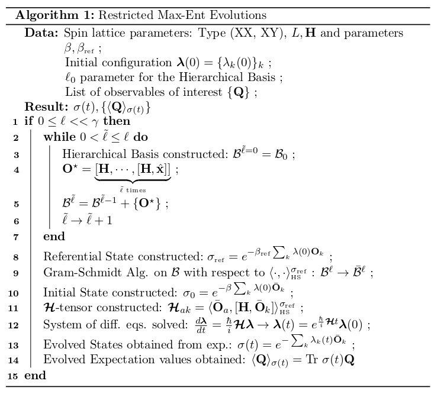
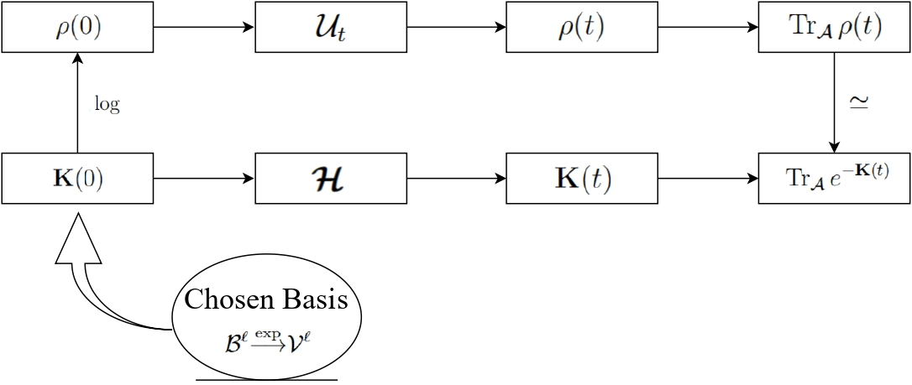

# Gaussian-like Restricted Max-Ent Dynamics for Spin Systems &middot; 

[](https://github.com/licTomasPerez) [](https://www.npmjs.com/package/npm) [](http://makeapullrequest.com) [](https://github.com/your/your-project/blob/master/LICENSE)

<br />
<p align="center">
  
  <h2> A Systematic Algorithm for the simulation of approximate closed Quantum Dynamics for Interacting Spin Systems </h2>
  <p align="center">
  </p>
</p>

Codebase and Documentation for the upcoming paper titled "Gaussian-like Max-Ent restricted Dynamics for Spin Systems"

<!-- TABLE OF CONTENTS -->
<details open="open">
  <summary>Table of Contents</summary>
  <ol>
    <li>
      <a href="#overview">Overview</a>
      <ul>
        <li><a href="#built-with">Built With</a></li>
      </ul>
    </li>
    <li>
      <a href="#getting-started">Getting Started</a>
      <ul>
        <li><a href="#prerequisites">Prerequisites</a></li>
        <li><a href="#installation">Installation</a></li>
      </ul>
    </li>
    <li><a href="#usage">Usage</a></li>
    <li><a href="#contributing">Contributing</a></li>

  </ol>
</details>

## Overview:

For a large many-body environment-non-interacting quantum system, the Schr\"odinger equation describes the coupled evolution of all of the system's possible correlations. The exact solution is, in all but a few cases, an analytically intractable and numerically expensive problem to solve, since the number of correlations present in an $N$-body quantum system, grows as ${\cal O}(\exp N)$. Hence, this coupled evolution implies that the configuration space of density states is a very intricate and complicated mathematical object. 

We circumvent this dramatic overhead in computational resources by noting that not all correlations equally weigh in on the system's dynamics, allowing us to develop a systematic approach for simulating approximate closed dynamics, combining the notions of **Gaussianizations** and **Max-Ent** and the idea of **orthogonal projection**. In particular, we consider closed approximate dynamics of **generalized Gaussian states**, defined via the Max-Ent principle.
These generalized Max-Ent states, then, contain some of the most relevant correlations present in the system. 

These ideas and methods will be used, in this repository, to simulate the dynamics of the Heisenberg-like XX and XY models. 

<p align="center">

</p>

<p align="center">

</p>

## Built with:

This implementation has been written in Python 3, using several external and user-defined libraries, namely

* [Quantum Toolbox in Python](https://qutip.org/qutip-tutorials/)
* [NumPy](https://numpy.org/doc/)
* [SciPy](https://docs.scipy.org/doc/scipy/index.html)

## Prerrequisites for use:

Have Python 3 installed

1. Clone the repo
   ```sh 
   git clone https://github.com/licTomasPerez/Max-Ent_Dynamics.git
   ```
2. Optional, but highly recommended. Create a virtual environment to avoid conflict with other dependencies
  ```sh
  python3 -m virtualenv {NameOfVirtualEnv}
  ```
  And activate the virtual environment
  ```sh
  source {NameOfVirtualEnv}/bin/activate.sh
  ```
3. Install libraries
   ```sh
   (NameOfVirtualEnv) pip3 install -r requirements.txt
   ```
4. Now you are ready to run custom restricted Max-Ent evolutions!
  ```sh
  (NameOfVirtualEnv) python3 meta_main.py
  ```
  
## Usage:

First and foremost, one must characterize the spin system. The code comes with a series of pre-defined Hamiltonians (e.g. XX, XY, XXX, etc.), with or without closed boundary conditions, etc., for which one must only specify the relevant parameters. 

Then, one must specify the desired $\ell$ dimensions, for which the restricted Max-Ent evolution on ${\cal V}^{\ell}$ is desired, alongside the chosen observables of interest, for which their time evolved expectation values are desired. 

Optionally, one can also compute the exact evolution by invoking QuTiP's *mesolve* function, for easy comparison of the approximate and exact results. 
Moreover, a series of <a href= https://github.com/licTomasPerez/Max-Ent_Dynamics/tree/main/Hierarchical_Basis_Codebase/Tutorials>tutorials</a> have been written in order to demonstrate how to carry out restricted Max-Ent evolutions for some simples quantum mechanical spin systems.

## Contributing

Contributions are open! Feel free to contact me via my socials. 

## Specifications
